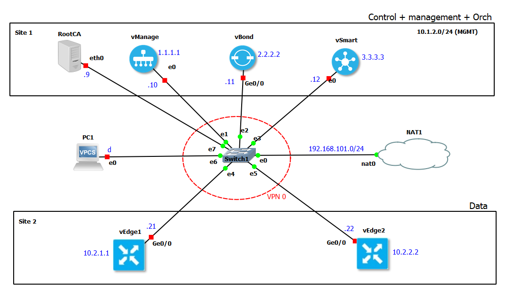
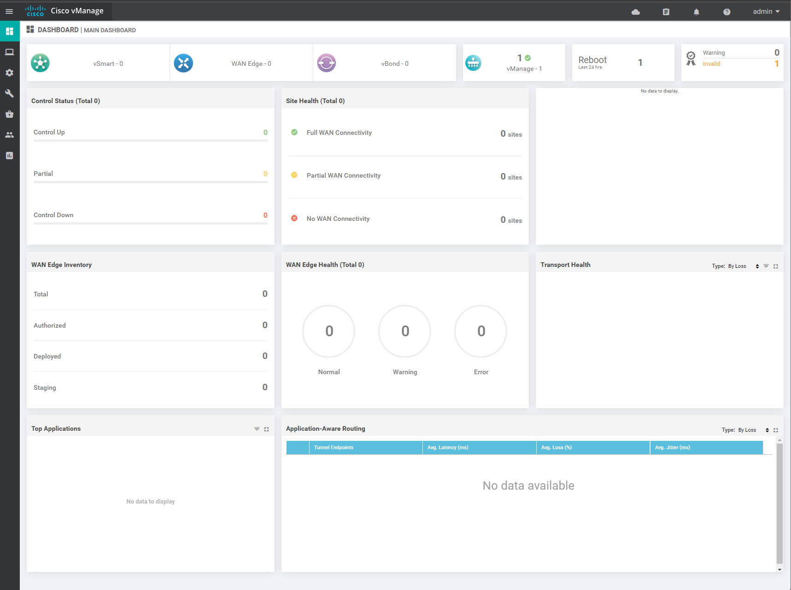
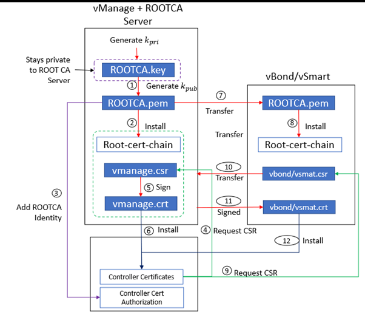

# 1. Topology



# 2. Device summary 
| Device Name | Purpose | System IP | Interface Name | Interface IP | 
| -- | -- | -- | -- | -- | 
| RootCA | Ubuntu Container for Enterprize RootCA Server | N/A | eth0 | DHCP |
| VManage | management Plane | 1.1.1.1 | eth0 | 192.168.101.10/24 |
| VBond | orchestration Plane | 2.2.2.2 | g0/0 | 192.168.101.11/24 |
| VSmart | Control Plane | 3.3.3.3 | eth0 | 192.168.101.12/24 | 
| VEdhge1 | Edge device | 10.2.1.1 | g0/0 | 192.168.101.21/24 |
| VEdhge2 | Edge device | 10.2.2.2 | g0/0 | 192.168.101.22/24 |

# 3. System Bootup 

1. Bootup all devices, wait until the "`System Ready`" prompt arives.
2. Login with the default credentials __admin/admin__ 
3. After the first bootup, VManage will ask to select the data volume, choose dist with 100G capacity and proceed with formatting. VManage will reboot afterwards.  

# 4. Skinny Config 

The Skinny confing is the initial base configuration on the Viptela devices. This provissions the devices for further configurations.
1. __System Configuration__: Configure the System specific (HVOSS) parameters i.e., Host-name, VBond IP, Organization name, Site-ID and System-IP. 
2. __VPN Configuration__: There are two default VPNs, VPN-0 (192.168.101.0/24) for transport and VPN-512 (10.1.2.0/24) for management. 

_NOTE: the configuration parameters are specific to my lab, adjust them according to yours._ 

## 4.1. VManage 

```
conf t
    system 
        host-name vmanage
        vbond 192.168.101.11
        org RISHI_HOME_LAB
        site-id 1
        system-ip 1.1.1.1
    exit
    !
    vpn 0
        ip route 0.0.0.0/0 192.168.101.1
        interface eth0
            ip add 192.168.101.10/24
            no tunnel
            no shut 
        exit
        no interface eth1
    exit
    !
    vpn 512
        interface eth1
            ip add 10.1.2.10/24
            no shut
        exit
    exit
    commit
end
```

* To verify reachability, ping the VManage VPN0 IP `192.168.101.10` from the host. (_Note: This might take a while affter commit_)
* Access the VManage web GUI by its IP (here, 192.168.101.10) using a local browser.
* All VPN-0 has a static-default route `0.0.0.0/0` pointing to the next hop as the NAT interface (VMWare VMNet-8), here, `192.168.101.1`  



## 4.2. VBond 
While allocating IP to the transport interface, the `local` keyward changes the default VEdge behaviour to VBond. 

```
conf t
    system 
        host-name vbond
        vbond 192.168.101.11 local
        org RISHI_HOME_LAB
        site-id 1
        system-ip 2.2.2.2
    exit
    !
    vpn 0
        ip route 0.0.0.0/0 192.168.101.1
        interface ge0/0
            ip add 192.168.101.11/24
            no tunnel
            no shut 
        exit
    exit
    !
    vpn 512
        interface eth0
            ip add 10.1.2.11/24
            no shut
        exit
    exit
    commit
end
```

## 4.3. VSmart

```
conf t
    system 
        host-name vsmart
        vbond 192.168.101.12
        org RISHI_HOME_LAB
        site-id 1
        system-ip 3.3.3.3
    exit
    !
    vpn 0
        ip route 0.0.0.0/0 192.168.101.1
        interface eth0
            ip add 192.168.101.12/24
            no tunnel
            no shut 
        exit
        no interface eth1
    exit
    !
    vpn 512
        interface eth1
            ip add 10.1.2.12/24
            no shut
        exit
    exit
    commit
end
```

Test reachability to VManage from both VBond and VSmart by pinging the `192.168.101.10` address. 

# 5. ROOT CA Configuration and Controller Bring-up

For the home lab setup, a enterprize ROOT CA server is sufficient to allocate certificates. The SD-WAN fabric (i.e. all WAN devices) use the cerficates for mutual authentication. The process is as follows. 
1. Create a Local Enterprize root CA server (Linux / Windows Server). The VManage can itself become a rootCA as it runs linux underneath. 
2. Create a private key at ROOT-CA (`ROOTCA.key`)
3. Generate a public key from the provate key (`ROOTCA.pem`)
4. Register the ROOTCA server to VManage using `ROOTCA.pem` file. 
5. For all controllers (VManage, VBond and VSmart)
    * bring the `ROOTCA.pem` file to local directory 
    * install the `ROOTCA.pem` file to local `root-cert-chain`, to inform the OS where the RootCA server is.
    * generate a CSR request from the VManage UI, this creates a CSR file to the controller file systems. 
    * Bring the CSR file to the ROOTCA server and sign. 
    * Install the signed certificate at the VManage. 
6. Once done, turn on tunnelling at the transport interface of all controllers.




## 5.1. Make a ROOTCA Server 

```
# install OpenSSL and SSH
sudo apt -y install openssl openssh-server

# generate private key 
openssl genrsa -out ROOTCA.key 2048

# generate public key from the private key
openssl req \
	-x509 -new -nodes \
	-key ROOTCA.key -sha256 \
	-days 2000 \
	-subj "/C=AU/ST=NSW/L=NSW/O=sdwan-testlab/CN=vmanage.lab" \
	-out ROOTCA.pem

# allow ssh to root (Not recommanded for production)
echo 'PermitRootLogin yes' >> /etc/ssh/sshd_config

# Restart SSH service to take effect
/etc/init.d/ssh restart

# set a root password
passwd
```

You must see `ROOTCA.key` and `ROOTCA.pem` file at your local directory. 

```
root@RootCA:~# ls
ROOTCA.key  ROOTCA.pem
```

## 5.2. Register the ROOTCA server to VManage 

Goto __VManage GUI -> Admininstration -> settings__ and put the following details. 
1. Organization name 
2. VBond IP
3. Controller Certificate Authorization -> Enterprize Root Certificate -> paste the content of `ROOTCA.pem` file.   


## 5.3. Add controllers 
Now the ROOT CA server is registered to the VManage. Each controller needs to mutually authenticate. 
For each controller (VManage, VSmart and VBond), do the following. 
1. __Generate CSR__ : __VManage UI -> Configuration -> Certificates -> Controllers -> _choose one_ -> ... -> Generate CSR__. This creates a CSR file at the '`/home/admin`' directory of the controller.
2. __Add Controllers__: __Vmanage UI -> Configurtion -> Devices -> Controllers -> Add Controllers -> _choose vBond and vSmart_ ->  give IP, username, password and check Generate CSR__. 
2. __Get ROOTCA.pem__ : Each controller needs to bring the `ROOTCA.pem` from the RootCA server (here, `192.168.101.133`). Run this command under the `vshell`. 
	```
	vshell
	scp root@192.168.101.133:ROOTCA.pem .
	exit
	```
3. __Install ROOTCA identity to cert-chain__: Each controller needs to install the ROOTCA identity (`ROOTCA.pem`) to its local `root-cert-chain`. 
	```
	request root-cert-chain install /home/admin/ROOTCA.pem 
	```
4. __Sign CSR__: Bring the CSR files from the Controllers to the ROOTCA Server and sign them. The signed certificates are the CRT files. Run the following script at the ROOT-CA server, change the variables as per your topology. The script will brinf the CSR files from the controller node, sign them and create a signed certificate as CRT file. 


```
# set variables 
vmanage=192.168.101.10
vbond=192.168.101.11
vsmart=192.168.101.12
pass=admin    #not recommanded for production 

# bring the CSR files from controllers
sshpass -p $pass \
	scp -o StrictHostKeyChecking=no \
	admin@$vmanage:vmanage_csr .
sshpass -p $pass \
	scp -o StrictHostKeyChecking=no \
	admin@$vbond:vbond_csr .
sshpass -p $pass \
	scp -o StrictHostKeyChecking=no \
	admin@$vsmart:vsmart_csr .

# Sign the CSR files and generate CRT files (signed certificates) 
openssl x509 \
	-req -in vmanage_csr \
	-CA ROOTCA.pem \
	-CAkey ROOTCA.key \
	-CAcreateserial -out vmanage.crt \
	-days 2000 -sha256

openssl x509 \
	-req -in vbond_csr \
	-CA ROOTCA.pem \
	-CAkey ROOTCA.key \
	-CAcreateserial -out vbond.crt \
	-days 2000 -sha256

openssl x509 \
	-req -in vsmart_csr \
	-CA ROOTCA.pem \
	-CAkey ROOTCA.key \
	-CAcreateserial -out vsmart.crt \
	-days 2000 -sha256
```

5. __Install signed Certificates__: __Vmanage UI -> configuration -> certificates -> Controllers -> install -> _paste CRT file contents_ -> install__ 

## 5.4. Turn on Tunnels

As the mutual authentication is finished, now the controller nodes can turn their tunnel interfaces. run the follwing config on the controller nodes. 

### 5.4.1. VManage
```
conf t
    vpn 0
        int eth0
            tunnel-interface
            commit
        !
    !
end 
``` 
### 5.4.2. VBond
```
conf t
    vpn 0
        int ge0/0
            tunnel-interface
                encap ipsec
                allow-service all
                allow-service netconf sshd
                commit
            !
        !
    !
end 
``` 
### 5.4.1. VManage
```
conf t
    vpn 0
        int eth0
            tunnel-interface
            commit
        !
    !
end 
``` 

# 6. VEdge Bring-up


```python

```


```python

```
